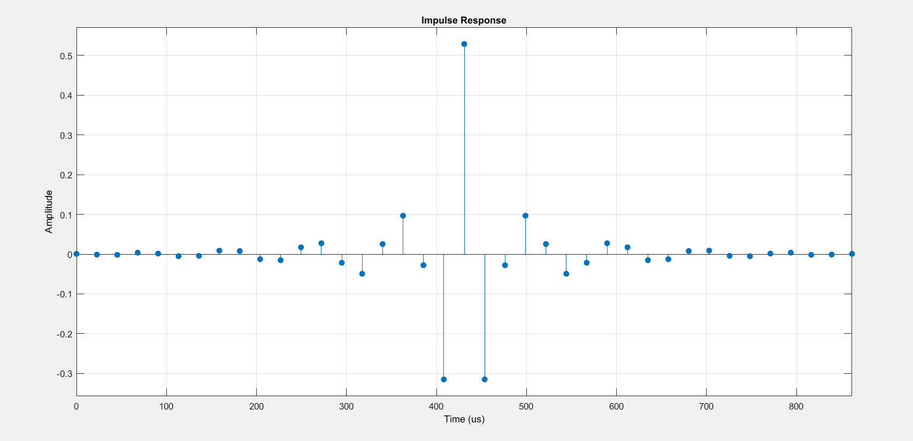

# DSP_LAB
This repo contains MATLAB script files made as part of DSP LAB

## Design of an **Audio Crossover Unit** using *MATLAB & Simulink*.

### Screenshots

Implementation of the design in *Simulink*.

Impulse Response of the FIR Low Pass Filter (LPF)

Magnitude and Phase Response of the LPF:

Impulse Response of the FIR Band Pass Filter (BPF)

Magnitude and Phase Response of the BPF:

Impulse Response of the FIR High Pass Filter (HPF)

Magnitude and Phase Response of the HPF:

